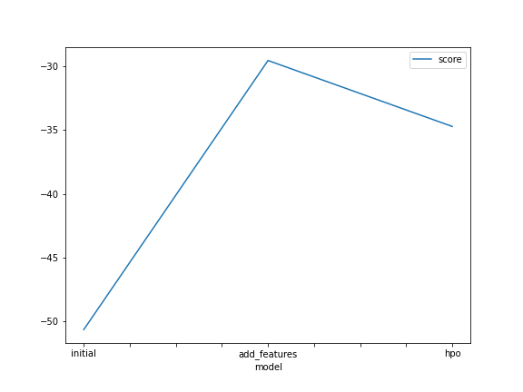
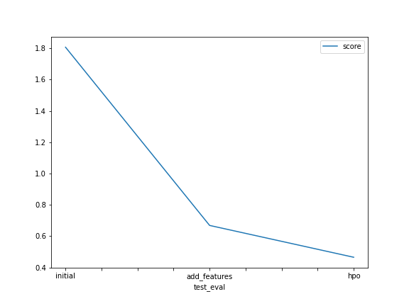

# Report: Predict Bike Sharing Demand with AutoGluon Solution
#### Liu Zongyuan

## Initial Training
### What did you realize when you tried to submit your predictions? What changes were needed to the output of the predictor to submit your results?
There was no negative prediction when I checked the predictions with describe() funcion. So I could submit the predictions successfully.

### What was the top ranked model that performed?
WeightedEnsemble_L3

## Exploratory data analysis and feature creation
### What did the exploratory analysis find and how did you add additional features?
The number of total rentals for workingdays and non-holidays is more than that for non-workingdays and holidays. In addition, one would expect a greater demand for rental bikes during office hours such as mornings or evenings. So one can split datetime into date and time to feed the model with the corresponding features. Below are the additional features I added:

```
year,
month,
week,
day,
hour,
saturday,
sunday,
```

### How much better did your model preform after adding additional features and why do you think that is?
Before adding new features, the initial value of rmse with autogluon is 1.80690. I tried adding different features to see if kaggle's results improved:

1. After adding the new features of `year, month, week, day, hour`, the rmse is 0.66850;
2. After adding new features such as `year, month, week, day, dayofweek, hour, saturday, sunday`, the rmse is 0.69380;
3. After adding new features such as `year, month, day, hour, perform map processing on year - {2011:0, 2012:1}`, rmse is 0.67641;

Obviously, the first feature combination has the best improvement with an increase of 63% dropping from 1.8069 to 0.6685 of rmse.

## Hyper parameter tuning
### How much better did your model preform after trying different hyper parameters?

For Autogluon's hyperparamter optimization, I choose the snippet script on the official website, and then make a comparison on this basis

```
import autogluon.core as ag

nn_options = {  # specifies non-default hyperparameter values for neural network models
    'num_epochs': 10,  # number of training epochs (controls training time of NN models)
    'learning_rate': ag.space.Real(1e-4, 1e-2, default=5e-4, log=True),  # learning rate used in training (real-valued hyperparameter searched on log-scale)
    'activation': ag.space.Categorical('relu', 'softrelu', 'tanh'),  # activation function used in NN (categorical hyperparameter, default = first entry)
    'dropout_prob': ag.space.Real(0.0, 0.5, default=0.1),  # dropout probability (real-valued hyperparameter)
}

gbm_options = {  # specifies non-default hyperparameter values for lightGBM gradient boosted trees
    'num_boost_round': 100,  # number of boosting rounds (controls training time of GBM models)
    'num_leaves': ag.space.Int(lower=26, upper=66, default=36),  # number of leaves in trees (integer hyperparameter)
}

hyperparameters = {  # hyperparameters of each model type
                   'GBM': gbm_options,
                   'NN_TORCH': nn_options,  # NOTE: comment this line out if you get errors on Mac OSX
                  }  # When these keys are missing from hyperparameters dict, no models of that type are trained

time_limit = 10*60  # train various models for ~2 min
num_trials = 5  # try at most 5 different hyperparameter configurations for each type of model
search_strategy = 'auto'  # to tune hyperparameters using random search routine with a local scheduler

hyperparameter_tune_kwargs = {  # HPO is not performed unless hyperparameter_tune_kwargs is specified
    'num_trials': num_trials,
    'scheduler' : 'local',
    'searcher': search_strategy,
}

```

hpo1: set `time_limit = 10*60`, rmse is 0.46777;
hpo2: Set `num_epochs=100` instead of 10 for nn_options, the others are the same as hpo1, rmse is 0.46521;
hpo3: set `num_trials=10` instead of 5, others are consistent with hpo1, rmse is 0.46876;
hpo4: set `time_limit = 10*60` and `auto_stack=True`, rmse is 0.47746;

The rmse of hpo2 is the best, which drops from 0.6685 to 0.4652, a 30.41% improvement.


### If you were given more time with this dataset, where do you think you would spend more time?

I want to do more feature engineering like adjusting for the seasons or working hours;
Also, I would like to try models other than Autogluon and do hyperparameter tuning.

### Create a table with the models you ran, the hyperparameters modified, and the kaggle score.
|model|hpo1|hpo2|hpo3|hpo4|score|
|--|--|--|--|--|--|
|initial|default values|default values|default values|default values|1.80690|
|add_features|default values|default values|default values|default values|0.6685|
|hpo|NN epochs:[10], num_trials: [5]|NN epochs:[100], num_trials:[5]|NN epochs:[10], num_trials:[10]|auto_stack=True, NN epochs: [10], num_trials: [5]|0.4652|


### Create a line plot showing the top model score for the three (or more) training runs during the project.



### Create a line plot showing the top kaggle score for the three (or more) prediction submissions during the project.



## Summary

This project uses the Autogluon package to implement the prediction of a Kaggle competition on "Bike Sharing Demand" in Amazon Sagemaker Studio.

Autogluon is a simple-to-use, incredibly powerful package which can implement the whole machine learning workflow with just a few lines of code spanning image, text, and tabular data. Here we focus on the AutoGluon’s Tabular Prediction.

The following three sections make up our entire work:

1. Create a baseline model directly using Autogluon

   set the parameters as `eval_metric='root_mean_squared_error, time_limit=10*60, presets='best_quality'`. The initial score is 1.80690.

2. Exploratory Data Analysis and Creating an additional feature

   2a). Split the `datetime` into `year, month, week, day, hour`

   2b). Split the `datetime` into `year, month, week, day,dayofweek, hour, saturday, sunday`

   2c). Split the `datetime` into `year, month, week, day, hour` and perform map processing on year - {2011:0, 2012:1}

3. Rerun the model with the same settings as before, just with more features

   | features | rmse score  |
   | -------- | ----------- |
   | 2a       | **0.66850** |
   | 2b       | 0.69380     |
   | 2c       | 0.67641     |

   Splitting the `datetime` into `year, month, week, day, hour` outperforms the other feature   groups. 

4. Hyper parameter optimization

   | hpo  | hyperparams                                       | rmse score  |
   | ---- | ------------------------------------------------- | ----------- |
   | hpo1 | NN epochs:[10], num_trials: [5]                   | 0.46777     |
   | hpo2 | NN epochs:[100], num_trials:[5]                   | **0.46521** |
   | hpo3 | NN epochs:[10], num_trials:[10]                   | 0.46876     |
   | hpo4 | auto_stack=True, NN epochs: [10], num_trials: [5] | 0.47746     |

​	The hpo2 with `NN epochs:[100], num_trials:[5]` outperform than other hpo combinations.

Let's see the final scores below:

| model        | score   |
| ------------ | ------- |
| initial      | 1.80690 |
| add_features | 0.6685  |
| hpo          | 0.4652  |

We can see that the improvement in model performance is greatly influenced by the feature engineering and hyperparameter optimization parts with an increase of **74.25%**.

Further work:

1. Experiment out several models, such as classical and deep learning models, to determine whether they can improve the performance.
2. Do more feature engineering like adjusting for the seasons or working hours.


